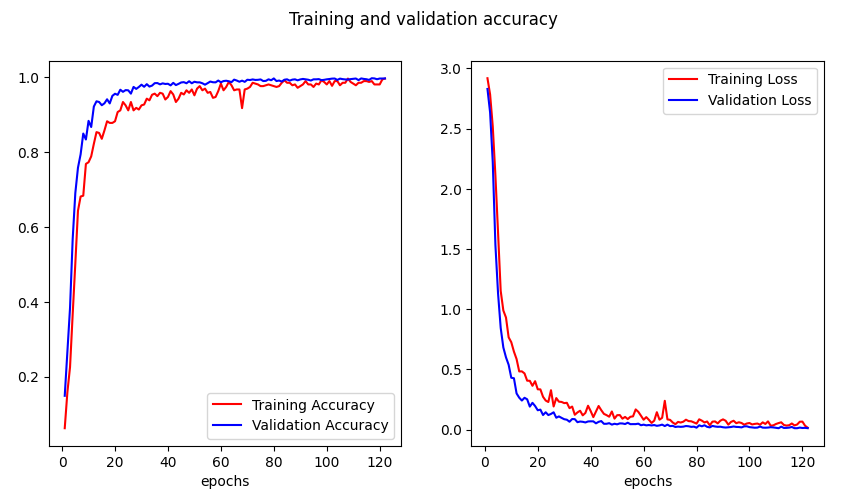
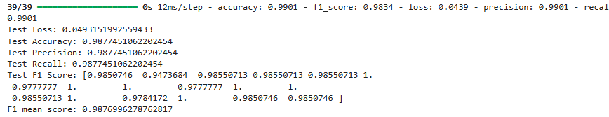

# sastrabali-ml

## Overview

We built a machine learning model for Balinese Aksara classification using Convolutional Neural Network (CNN).

## Dataset

The data we used to build the aksara classification model came from 2 sources:

- [Kaggle](https://www.kaggle.com/datasets/wildanfatahh22/aksara-bali/data?select=AKSARA+WYAJANA+ALL)
- Handwritten (We created our own aksara dataset)

## Implementation

Firstly, we combined all the data we used into a single folder called `dataset`. Before using it to train the model, we augmented the dataset using `augmentation.ipynb`. We then train the model, tune it and also test it until we were satisfied with the model's performance, lastly we saved it as a tflite model using `classification.ipynb`. Lastly, before handing the model to the mobile development team, we add metadata to the model to help the integration process of the model to the mobile application using `metadata.ipynb`.

## Result

- Training Result
  
- Testing Result
  

## Prerequisites

Before you begin, make sure you have the following installed and set up:

1. **Python**: Version 3.8 or higher. You can download Python from [python.org](https://www.python.org/downloads/).
2. **pip**: Ensure you have the latest version of pip by running:
   ```bash
   python -m pip install --upgrade pip
   ```
3. **Virtual Environment** (optional but recommended): Create and activate a virtual environment to manage dependencies easily:

   ```bash
   # On Linux/MacOS
   python -m venv venv
   source venv/bin/activate

   # On Windows
   python -m venv venv
   venv\Scripts\activate
   ```

## Installation

1. Clone the repository:

   ```bash
   git clone <repository-url>
   cd <repository-name>
   ```

2. Install the required dependencies:

   ```bash
   pip install -r requirements.txt
   ```

   The `requirements.txt` includes the following key dependencies:

   - TensorFlow
   - TensorFlow Lite
   - Any other dependencies needed for the project

3. Verify the installation:
   ```bash
   python -c "import tensorflow as tf; print(tf.__version__)"
   ```
   Ensure the output displays a valid TensorFlow version.

### Notes:

- Ensure your system has sufficient GPU or CPU resources to run TensorFlow efficiently.
- Refer to the documentation or comments in the script for additional details or parameters.
